## Lesson5

### pigeon

> 1. I have just received a pigeon from my brother.
> 2. On the last day, I made a decision and sent the pigeon to my friend, Leo.

### message

> 1. leave sb. a message
>    1. I left him a message.
>    2. Did you leave him a message?
>    3. Why did you leave him a message?
> 2. receive(get) a message/send a message
> 3. leave a message

### cover

### distance

> 1. The bird covered the distance in three minutes.
>    1. Did the bird covered the distance in three minutes?
> 2. conver the distance in st.

### request

> 1. send a request for sth
>    1. I have just sent a request for new computer.

### spare part

> 1. I need to buy some spare parts for my car.
>    1. Do you need to buy some spare parts for your car?
>    2. What do you need to buy for you car?

### service

> 1. He has begun his own private "telephone" service.
>    1. He began his own private telehone service.
>    2. Did he begin his own private telephone service?
>    3. How/Why...?
> 2. customer service

### Grammer

> 1. Tom watched TV last night.
>    1. Tom didn't watch TV last night
>    2. Did Tom watch TV last night?
> 2. Emily was at the office this morning.
>    1. Emiky wasn't at the office this morning?
>    2. Was Emily at the office this morning?

> 1. Do you want to have dinner?
>    1. I have just had some food.(I'm full now)
> 2. I have lived in Beijing for 10 years/since 2012.
>    1. I have been for 6 years.

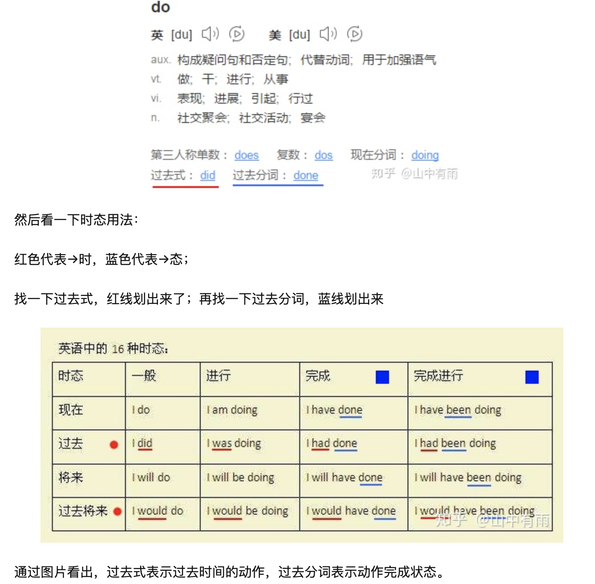

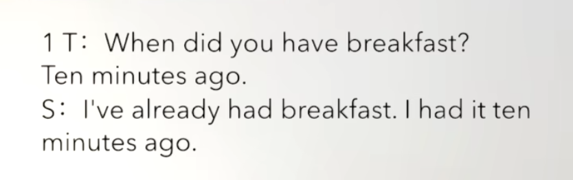

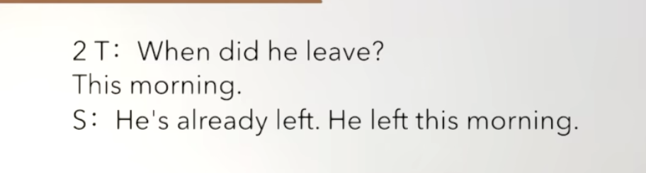

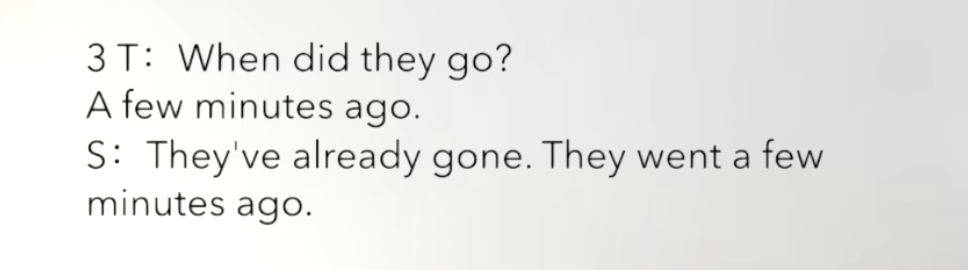

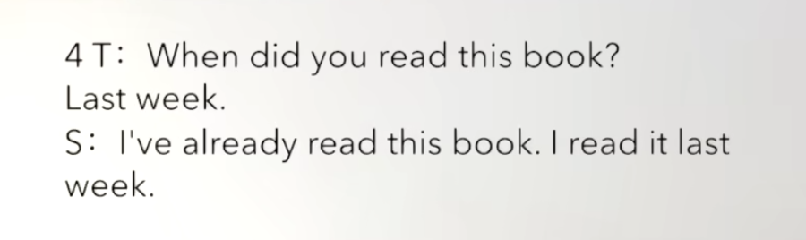

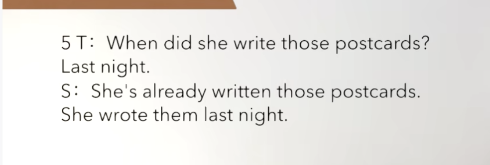

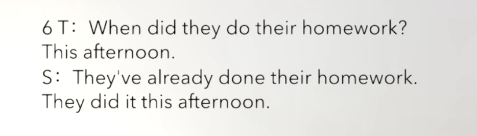

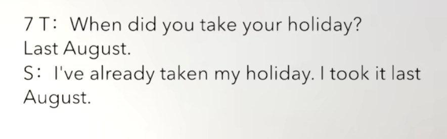

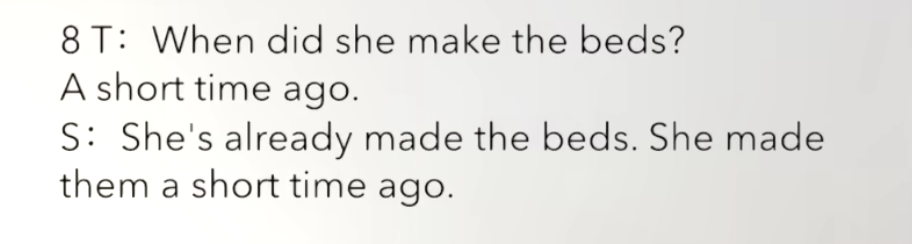

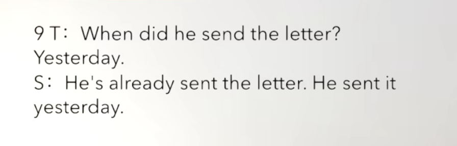

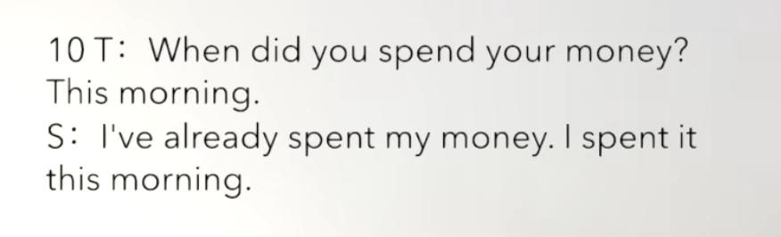

### Pattern drill

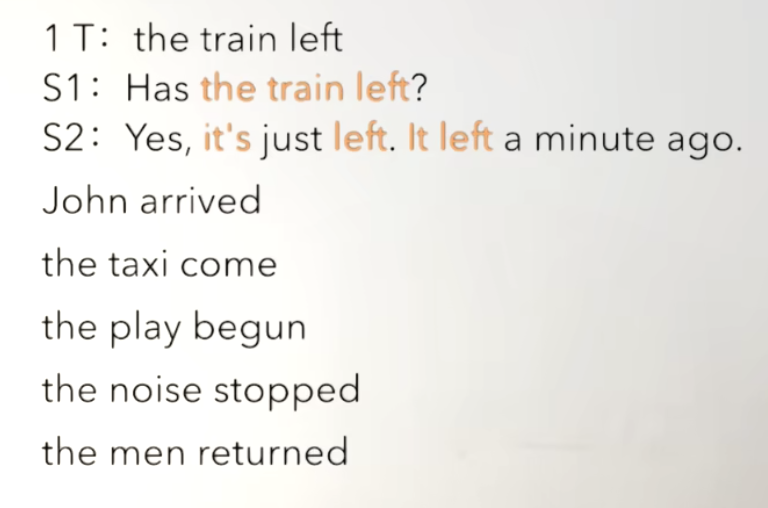

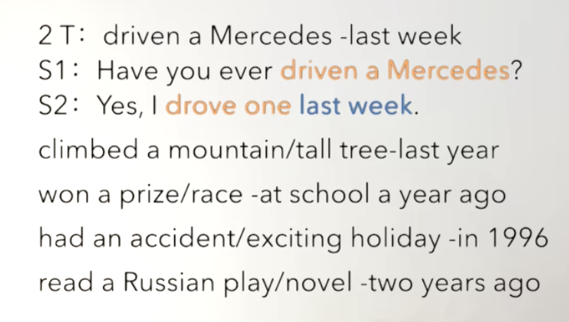

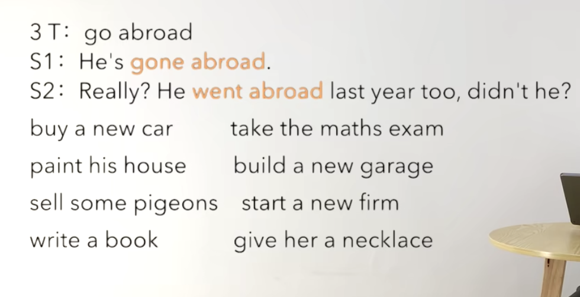

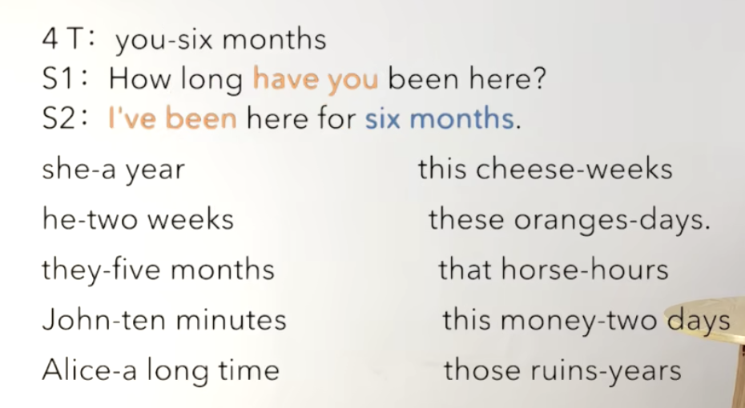

### Story

> Mr. James Scott has a garage in Silbury and
>
> now he has just bought another garage in Pinhurst.
>
> Pinhurst in only five miles from Silbury,
>
> but Mr.Scott cannot get a telephone for his new garage,
>
> so he has just bought twelve pigeons.
>
> Yesterday, a pingeon carried the first message from Pinhurst to Silbury.
>
> The bird covered the distance in three minutes.
>
> Up to now, Mr. Scott has sent a great many
>
> requests for spare parts and other ugent
>
> message from one garage to the other.
>
> In this way, he has begun his own private telephone service.

> 1. A is 5 miles from B
>    1. Beijing is 662 miles from Shanghai.
>    2. Is Beijing 662 miles from Shanghai?
> 2. get sth. for sb
>    1. I can get that for you.
>    2. Can you get that for me?
>    3. I can't get that for you.
>    4. Why can't you get that for me?
> 3. cover the distance in st.
>    1. The bird covered the distance in three minutes.
>    2. Did the bird cover the distance in three minutes?
> 4. up to now
>    1. I have sent a great number of postcards to him up to now.
> 5. a great many + 可数名词复数
>    1. Last night, we said a great many things.
>    2. Did you say a great many things last night?
> 6. send a request for sth
>    1. I sent a request for some paper 10 days ago.
> 7. in this way
>    1. In this way, I always have a goods seat in the theatre.

