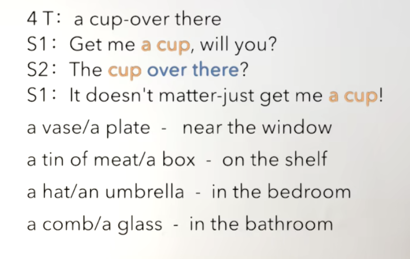

## Lesson6

### beggar

> 1. get sth. for sb.
>    1. Can we get some food for that beggar?
> 2. find n. adj
>    1. I find that begger interesting.

### food

> 1. He spoilt all the food.
>    1. Did he spiol all the food?
>    2. How did he spoil all the food?

### pocket

> 1. There is some money in my pocket.
> 2. The money is in my pocket.
> 3. My pocket is too small.
> 4. pocket money

### call

> 1. call at: to stop at (a place) briefly VS visit
>    1. He calls at every house in the street once a month.
>    2. Does he call at every house in the street once a month?
>    3. who/how often/why

> 1. a/an/the + n
>    1. a pen （辅音）
>    2. an apple（元音）
>    3. There is a pen on the table. （泛指）
>    4. The pen is Leo's.（特指）
>    5. I'm not a big fat panda, I'm the big fat panda.
> 2. some/any + n

### Story

> I have just moved to a house in Bridge Street.
>
> Yesterday a beggar knocked at my door.
>
> He asked me for a meal and a glass of beer.
>
> In return for this, the beggar stood on his head and sang songs.
>
> I gave him a meal.
>
> He ate the food and drank the beer.
>
> Then he put a piece of cheese in his pocket and went away.
>
> Later a neighbor told me about him.
>
> Everybody konws him.
>
> His name is Percy Buttons.
>
> He calls at every house in the street once a month
>
> and always asks for a meal and a glass of beer.

### move to sw.

> 1. do/does:  
>    1. He always moves to Hainan every winter.
> 2. did:  
>    1. He moved to Hainan last winter.
> 3. have done: 
>    1.  He has just moved to Hainan.
> 4. am/is/are doing:  
>    1. He is moving to Hainan next month.

### knock at the door

> 1. Someone is knocking at the door.
>    1. Is someone knocking at the door?
>    2. Who is knocking at the door?

### ask sb. for sth

> 1. When I was young, I always asked my mom for pocket money.
> 2. I have just asked my brother for some food.

### in return for this

> 1. In return for this, I made that decision.
> 2. I am going to give hime some money every year.
> 3. The farmer gave us food in return for our work.
> 4. in return for your services

### stand on sb's head

> 1. Look , he is standing on his head.
>    1. Why is standing on his head?

### call at

> 1. He calls at every house in the street once a month.

### once a st.

> 1. Once a year my brother sends a postcard to me.
>    1. Does your brother send you a postcard once a year?
>    2. How often does your brother send you a postcard?
> 2. Once a year, he sent flowers to someone with his Visa card.

### ask for sth.

> 1. Can I ask for some water?
> 2. Don't give him more pocket money.
> 3. He's just asked for some from me.

