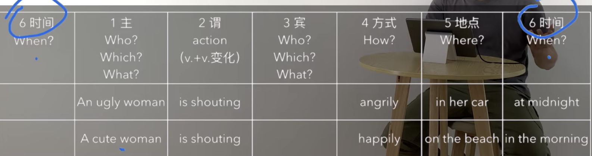

# English Learning

## A private conversation

### private

> 1. private life; private school; private hospital
> 2. go to a private school
>    1. He goes to a private school.
>    2. Does he go to a private school?
>    3. Why does he go to a private school?

### conversation

> 1. have a conversation
>    1. We are having a conversation. Please be quiet.
>    2. I had a conversation with him yesterday.
>    3. Did you have a conversation with him yesterday?
>    4. When did you have a conversation with him?
> 2. a private conversation
>    1. This is a private conversation.

### theatre

> 1. go to a theatre
>    1. I've never been to that theatre.
>    2. Have you ever been to that theatre?

### seat

> 1. have a good seat
>    1. I had a good seat.
>    2. I had a good seat yesterday.
>    3. Did you have a good seat?
>    4. Why did you have a good seat?
> 2. take a seat
> 3. Is this seat taken?

### play

> 1. watch a play
>    1. I am going to watch a play with my Mum.
>    2. I am going to watch a play with my Mum tonight.
>    3. Are you going to watch a play with my Mum tonight?

### loudly

> 1. take loudly
>    1. You are talking too loudly.
>    2. Why are you talking so loudly?
>    3. Don't talk so loudly in the theatre.

### angry

> 1. He was very angry yesterday.
>    1. Was he was very angry yesterday?
>    2. When was he very angry?
>    3. Why was he very angry yesterday?
> 2. Look at her angrily
>    1. He looked at her angrily this morning.
>    2. He looking at her angrily now.
>    3. Did you have looked at her angrily this morning?
>    4. How did you have looked at her this moring?
>    5. When did you have looked at her angrily?

### attention

> 1. pay attention
>    1. They did not pay any attention.
>    2. Did they pay any attention?

### bear

> 1. I could not bear it.
>    1. I can't bear that.
>    2. Can you bear that?
>    3. How can you bear that?

### business

> 1. business man
> 2. It's none of your business.

### rudely

> 1. Don't be rude. Let him in.
> 2. talk rudely
>    1. He was talking to her rudely.
>    2. Was he talking to her rudyly?
>    3. How was he talking to her?

### Grammar

> 1. It is night.
> 2. They are tried.
> 3. They are waiting for Godot.
>
> 
>
> 1. A woman is shouting.
>    1. An ugly woman is shouting angrily.
>    2. A cute woman is shouting happily.
>    3. An ugly woman is shouting angrily in the car.
>    4. A cute woman is shouting happily on the beach.
>    5. An ugly woman is shouting angrily in her car at midnight.
>    6. A cute woman is shouting happily on the beach in the morning.
> 2. I enjoyed the film yesterday.
> 3. I listened to the news carefully.
> 4. The man played the paino well.
> 5. The children played games quietly in their room yesterday.
> 6. He opened the door quietly.
> 7. He left immediately.
> 8. He planted a tree in the corner of the garden.
> 9. He read the letter quickly in his office before lunch.
> 10. I borrowed a book from the library this morning.
> 11. The cook spoilt the soup.
> 12. We stay at home on Sundays.
> 13. There are a lot of people at the bus stop.
> 14. The little boy ate an apple greedily in the kitchen this morning.
> 15. She draws beautifully.
> 16. I like music very much.
> 17. They built a new school in our village last year.
> 18. The match ended at four o'clock.
> 19. She received a letter from her brother last week.
>

### Pattern drill

> 1. How did she behave at the theatre?
>    1. She behaved very rudely at the theatre.
> 2. How did she drive through the park?
>    1. She drived very quickly throught the park.
> 3. How did she sleep on the train?
>    1. She sleeped very soundly on the train.
> 4. How did she listen to his story?
>    1. She listend very patinetly to his story.

> 1. I can hear the actors now. Can you?
>    1. Of course I can. I can hear it perfectly well.
> 2. I can see the theatre. Can you?
>    1. Of course I can. I can see it prefectly well.
> 3. I can hear the rain. Can you?
>    1. Of course I can. I can hear it prefectly well.
> 4. I can hear some music. Can you?
>    1. Of couser I can. I can hear it perfectly well.

> 1. I heard a voice at the door just now.
> 2. I saw a cry outside last night.
> 3. I saw a fly in my soup at lunch.
> 4. I saw a camel at the zoo last week.

> 1. Didn't you read the letter?
>    1. I couldn't. The writing was too small.
> 2. Didn't you see her face?
>    1. I couldn't. The light was too bad.
> 3. Didn't you swim in the lake?
>    1. I couldn't. The water was too deep.
> 4. Didn't you finish your launch?
>    1. I couldn't. The food was too hot.

> Last week I went to the theatre.
>
> I had a very good seat.
>
> The play was very interseting.
>
> I did not enjoy it.
>
> A young man and a young woman were siting behind me.
>
> They were talking loudly.
>
> I got very angry.
>
> I couldn't not hear the actors.
>
> I turned round.
>
> I looked at the man and the woman angrily.
>
> They did not pay any attention.
>
> In the end, I could not bear it.
>
> I turned round again.
>
> 'I can't hear a word!' I said angrily.
>
> 'It's none of  your business,' the young man said rudely.
>
> 'This is a private conversation!'

> 1. go to the theatre
>    1. I had to go to the theatre yesterday.
>    2. Did you have to go to the theatre yesterday?
>    3. Why did you have to go to the theatre yesterday?
>    4. When did you have to go to the theatre?
>    5. Where did you have to go to yesterday?
>    6. Who have to go the theatre yesterday?
> 2. have a good seat
>    1. I had a very good seat.
>       1. Did you have a good seat?
> 3. get angry
>    1. I got very angry.
>    2. He got very angry yesterday.
>    3. Did he get very angry yesterday?
>    4. Why did he get very angry yesterday?
>    5. When did he get very angry?
> 4. trun round
>    1. I truned round.
>    2. He always turns round in the class.
>    3. Does he always turns round in the class?
>    4. Why does he always truns round in the class?
>    5. How often does he truns round in the class?
> 5. pay attention
>    1. They did not pay any attention.
>    2. Did they pay any attention?
> 6. in the end
>    1. In the end, My mum and I went to the theatre.
>    2. Did your mum and you go to the theatre, in the end?
>    3. Where did your mun and you go in the end?
> 7. couln't bear it
>    1. I can't bear it.
>    2. Can you bear it?
>    3. How can you bear it?
> 8. It's none of your business

### Topics for discussion

> 1. When did you last go to the theatre/cinama? Tell me about the play/film.
> 2. Do you get angry easily? What sort of thing makes you angry?
> 3. Would you like to be an actor? Why/Why not?

## 

### until

> 1. I sometimes stay in bed until lunchtime.
>    1. I sometimes eat my dinner until 9.
>    2. I sometimes go to bed until 2 a.m.
>    3. Do you sometimes go to bed until 2 a.m?
>    4. How often do you go to bed until 2 a.m?
>    5. I couldn't swim until 21.

### outside

> 1. Look, there is a dog outside.
> 2. It was dark, outside.
>    1. Was it dark outside?
>    2. Why was it dark outside?
> 3. get inside & get outside

### ring

> 1. Just then, the telephone rang.
>    1. Did the telephone ring?
>    2. When did the telephone ring?
>    3. The telephone is ringing.
>    4. The phone rings at 8 every night.

### aunt uncle

> 1. meet
>    1. I met her aunt yesterday.
>    2. Did you meet her aunt yesterday?
>    3. Where did you meet her aunt yesterday?

### repeat

> 1. repeat after me
> 2. repeat your question.
>    1. Can you repeat your question?
>    2. Come again? & Pardon? & What?

### Grammer

> 1. be + doing
>    1. We are having a conversation.
>    2. She is not watching play.
>    3. Are they talking loudly?
>    4. I am meeting my friends tonight.
>    5. We're having a party next weekend.
> 2. do/does
>    1. He goes to that theatre every weekend.
>    2. They go to that theatre evety weekend.
>    3. He doesn't go to that theatre every weekend.
>    4. They don't go to that theatre evety weekend.
>    5. Does he go to that theatre every weekend.
>    6. Do they go to that theatre every weekend.
> 3. What
>    1. It is a terriable day.
>    2. What a terriable day (it is)!
>    3. This is a beautiful picture.
>    4. What a beautiful priture.
>    5. This is a wonderful garden.
>    6. What  a wonderful garden.
>    7. What a wonderful world.
>    8. What a wonderful phrase!
> 4. always/usually/sometimes

> It was Sunday.
>
> I never get up early on Sundays.
>
> I sometimes stay in bed until lunchtime.
>
> Last Sunday I got up very late.
>
> I looked out of the window.
>
> It was dark outside.
>
> 'What a day!' I thought.
>
> 'It's raining again.'
>
> Just then, the telephone rang.
>
> It was my aunt Lucy.
>
> 'I've just arrived by train,' she said.
>
> 'I'm coming to see you.'
>
> 'But I'm still having breakfast,' I said.
>
> 'What are you doing?' She asked.
>
> 'I'm having breakfast,' I repeated.
>
> 'Dear me,' she said.
>
> 'Do you always get up so late? It's one o'clock.'

> 1. get up early/late
>    1. He gets up early everyday.
>    2. Does he get up early everyday?
> 2. just then
>    1. Just then, the telephone rang.
>    2. Just then, my mom came in.
>    3. Just then, he turened round.
> 3. have breakfast
>    1. I usually have breakfast at 8.
>    2. Do you usually have brrekfast at 8?

## 

### postcard

> 1. buy sb sth. = buy sth. for sb.
>    1. I bought a postcard for him this morning.
>    2. Did you buy a postcard for him this morning?
>    3. Where did you buy a postcard for him this morning?
> 2. Where can I buy a postcard?

### send

> 1. send me a postcard
> 2. send sb. sth = send sth. to sb
>    1. My aunt has already sent me a postcard.

###  spoil

> 1. The cook spoilt the soup.
>    1. Did the cook spoilt the soup?
>    2. How did the cook spoil the soup?
> 2. Postcards always splil my holidays.
>    1. Postcards spoilt my last sunmmer holiday.

### museum

> 1. I visited museums.
>    1. Did you visit the museum in 2018?
>    2. When did you visit that museum?

### public

> 1. Public library; public garden
> 2. I go to that public garden every Sundays.
>    1. Do you go to that public garden every Sundays?

### friendly

> 1. He is very friendly.
>    1. Kiwi people are very friendly.
> 2. What a friendly guy.

### waiter

> 1. a friendly waiter + v. ?

### lend

> 1. lend sb. sth. = lend sth. to sb.
>    1. Could you lend me 20$?
> 2. borrow sth. from sb. / borrow sth.
>    1. I borrowed this book from the public library last week.
> 3. lend you some money

### decision

> 1. make a decision
>    1. I made a big decision last night.
>    2. Did you make a decision?
>    3. When did you make a decision?

### whole

> 1. I like eat whole grain bread.
>    1. I want to buy some whole grain bread.
> 2. whole day / week
>    1. I spent the whole day in my room.
>    2. Did you spend the whole day in your room?

### single

> 1. I did not write a single card.
>    1. Why didn't you write a single card.
>    2. I am not going to write a single card.
> 2. She's single
>    1. mind your own business

### Grammer

> am is are  ->  was were
>
> do does  ->  did
>
> 1. He was very angry yesterday.
> 2. He wasn't very angry yesterday.
> 3. Was he very angry yesterday?
> 4. I had breakfast this morning.
> 5. I didn't have breakfast this morning.
> 6. Did you have breakfast this morning?
> 7. I loved you

> 1. What did you give John yesterday?
>    1. I gave John a book.
> 2. What did you buy Jean yesterday?
>    1. I brought Jean a rose.
> 3. What did you teach Lucy yesterday?
>    1. I taught Lucy French.

> 1. Who did you show the key to? Tom or his mother?
>    1. I shown it to her, of course.

### Story

> Postcards always spoil my holidays.
>
> Last summer, I went to Italy.
>
> I visited museums and sat in public gardens.
>
> A friendly waiter taught me a few words of Italian.
>
> 'Then he lent me a book.
>
> I read a few lines, 
>
> but I did not understand a word.
>
> Every day I thought about postcards.
>
> My holidays passed quickly,
>
> but I dit not send cards to my friends.
>
> On the last day I made a big decision.
>
> I got up early and bought thirty-seven cards.
>
> I spent the whole day in my room.
>
> but I dit not write a single card!

> 1. teach sb. sth.
>    1. Leo teachers me English everyday.
>    2. Does Leo teach you English everyday?
>    3. Why does Leo teach you English everyday?
> 2. teach me a lesson
> 3. lend sb. sth
>    1. He lent me 20$ last night.
>    2. Did he lend you 20$ last night?
> 4. think about sth./sb.
>    1. I think about you every night and day.
> 5. send sth. to sb.
>    1. I did not send cards to my friends.
>    2. Do you send cards to your friends?
> 6. on the last day
>    1. On the last day, I couldn't bear it.
> 7. make a decision
>    1. I have to make this dicision everyday.
>    2. Do you have to make this decision everyday?
>    3. How often / why
> 8. spend st. sw.
>    1. I spent 3 years in New Zealand.

